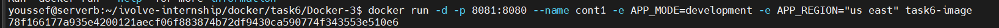
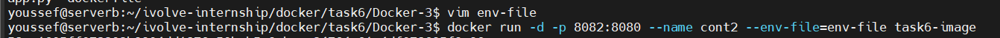
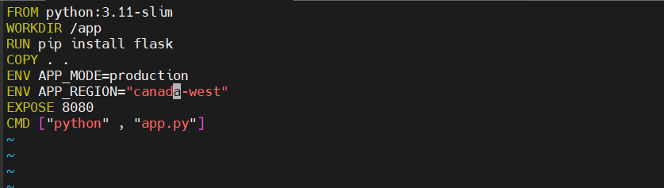
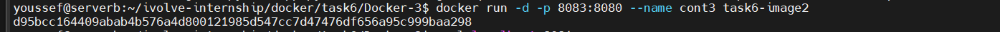
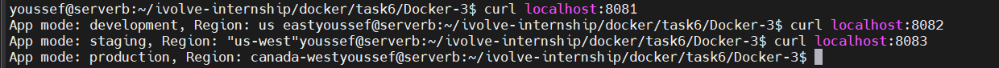

# Lab 6: Managing Docker Environment Variables (Flask App)

This lab demonstrates how to manage environment variables in Docker at **build time** and **runtime** using a simple Python Flask application.

---

## 🎯 Objectives
- Build a Docker image using Python
- Install Flask inside the container
- Run the Flask app on port **8080**
- Manage environment variables using:
  1. Command-line variables
  2. Environment file
  3. Dockerfile defaults

---

## 🛠 Prerequisites
- Docker installed and running
- Git installed
- Linux / WSL environment


---

## Step 1: Clone the Application Repository

```bash
git clone https://github.com/Ibrahim-Adel15/Docker-3.git
cd Docker-3
```


---

## Step 2: Create Dockerfile

Create a file named `Dockerfile`:

```dockerfile
FROM python:3.11-slim

WORKDIR /app

# Install Flask
RUN pip install flask


COPY app.py .

EXPOSE 8080

CMD ["python", "app.py"]
```


---

## Step 3: Build Docker Image

```bash
docker build -t task6-image .
```

Verify image:

```bash
docker images
```


---

## Step 4: Run Containers with Different Environment Variable Methods

### 4.1 Runtime Variables via Command Line (Development)

```bash
docker run -d -p 8081:8080 --name cont1 -e APP_MODE=development -e APP_REGION="us east" task6-image

```



---

### 4.2 Runtime Variables via Env File (Staging)

Create `env-file` file:

```env
APP_MODE=staging
APP_REGION=us-west
```

Run container:

```bash
docker run -d -p 8082:8080   --env-file=env-file   --name lab6-staging task6-image
```



---

### 4.3 Variables Defined in Dockerfile (Production)

## 4.3.1 create updated docker file

Create a file named `Dockerfile2`:

```dockerfile2
FROM python:3.11-slim

WORKDIR /app

# Install Flask
RUN pip install flask


COPY . .
ENV APP_MODE=production
ENV APP_REGION="canada-west"

EXPOSE 8080

CMD ["python", "app.py"]
```



## 4.3.2 Build Docker Image-2

```bash
docker build -t task6-image2 .
```

Verify image:

```bash
docker images
```


```bash
docker run -d -p 8083:8080 --name cont3 task6-image2
 
```



---

## Step 5: Test the Application

Using browser or curl:

```bash
curl http://localhost:8081
curl http://localhost:8082
curl http://localhost:8083
```



---

## Author
Youssef Elmansy
