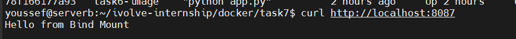
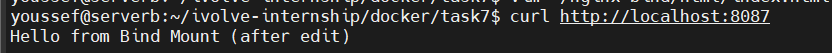
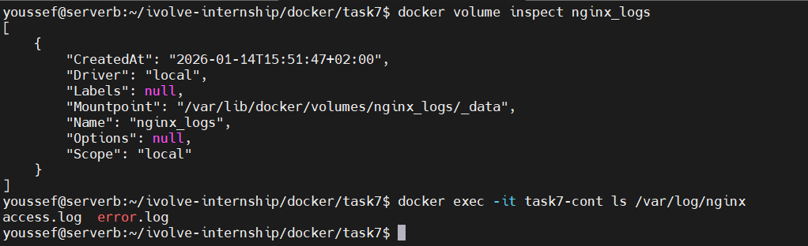

# Lab 7: Docker Volume and Bind Mount with Nginx

This lab demonstrates how to use **Docker Volumes** and **Bind Mounts** with an Nginx container to persist logs and serve custom HTML content from the host machine.

---

## 🎯 Lab Objectives
- Create a Docker volume to persist Nginx logs
- Use bind mount to serve HTML from host
- Verify live updates without restarting the container
- Inspect and delete Docker volumes

---

## 🛠 Prerequisites
- Docker installed and running
- Linux / WSL environment
- curl installed


---

## Step 1: Create Docker Volume

```bash
docker volume create nginx_logs
```

Verify volume:

```bash
docker volume ls
docker volume inspect nginx_logs
```

---

## Step 2: Create Bind Mount Directory

```bash
mkdir -p ~/nginx-bind/html
```

---

## Step 3: Create index.html File

```bash
vim ~/nginx-bind/html/index.html
```

Content:

```html
Hello from Bind Mount
```


---

## Step 4: Run Nginx Container

```bash
docker run -d   -p 8087:80   --name task7-cont   -v nginx_logs:/var/log/nginx   -v ~/nginx-bind/html:/usr/share/nginx/html   nginx
```

Check container:

```bash
docker ps
```


---

## Step 5: Verify Nginx Page

```bash
curl http://localhost:8087
```

Expected output:

```text
Hello from Bind Mount
```



---

## Step 6: Update index.html and Re-test

Edit file:

```bash
vim ~/nginx-bind/html/index.html
```

Update content:

```html
Hello from Bind Mount (after update)
```

Test again:

```bash
curl http://localhost:8087
```



---

## Step 7: Verify Logs in Volume

```bash
docker exec -it nginx-lab7 ls /var/log/nginx
```




---

## 🧠 Key Notes
- Docker volumes are managed by Docker and ideal for persistent data
- Bind mounts reflect host file changes instantly
- Nginx serves updated HTML without restart

---

## Author
Youssef Elmansy

