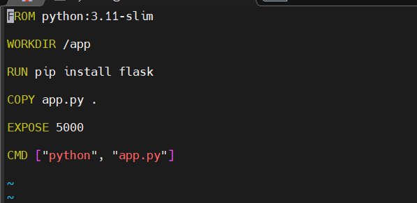
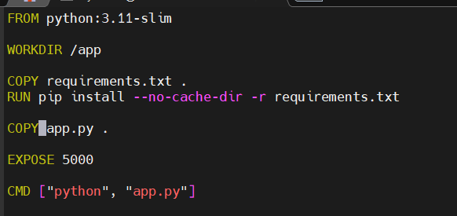
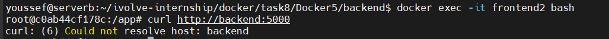

Lab 8: Custom Docker Network for Microservices

## Objective

Create a custom Docker network to allow selective communication between frontend and backend microservices using Docker containers.

---

## Steps and Commands

### 1. Clone Repository

```bash
git clone https://github.com/Ibrahim-Adel15/Docker5.git
cd Docker5
```

### 2. Dockerfiles

#### Backend Dockerfile (`backend/Dockerfile`)

```dockerfile
FROM python:3.11-slim
WORKDIR /app
RUN pip install flask
COPY app.py .
EXPOSE 5000
CMD ["python", "app.py"]
```


#### Frontend Dockerfile (`frontend/Dockerfile`)

```dockerfile
FROM python:3.11-slim
WORKDIR /app
COPY requirements.txt .
RUN pip install --no-cache-dir -r requirements.txt
COPY app.py .
EXPOSE 5000
CMD ["python", "app.py"]
```


### 3. Build Docker Images

```bash
docker build -t backend-image -f backend/Dockerfile ./backend
docker build -t frontend-image -f frontend/Dockerfile ./frontend
```

### 4. Create Custom Network

```bash
docker network create ivolve-network
docker network ls  # verify network
```

### 5. Run Containers on Networks

```bash
# Backend container on custom network
docker run -d --name backend --network ivolve-network backend-image

# Frontend1 container on custom network
docker run -d --name frontend1 --network ivolve-network frontend-image

# Frontend2 container on default network
docker run -d --name frontend2 frontend-image
```

### 6. Verify Communication

#### From frontend1 (on custom network)

```bash
docker exec -it frontend1 bash
curl http://backend:5000
```


> Should receive a response from backend.

#### From frontend2 (on default network)

```bash
docker exec -it frontend2 bash
curl http://backend:5000
```



> Will fail because frontend2 is not on `ivolve-network`.

### 7. Cleanup

```bash
docker rm -f backend frontend1 frontend2
docker network rm ivolve-network
```

---

## Notes / Expert Tips

* User-defined Docker networks allow containers to communicate using container names.
* Containers on default bridge network cannot resolve each other by name.
* Use `curl` or HTTP requests to test communication instead of `ping`.
* Optional: install `iputils-ping` in Dockerfile if ICMP ping is required.
* Clean up unused containers and networks regularly to avoid conflicts.

---

**End of Lab 8**
