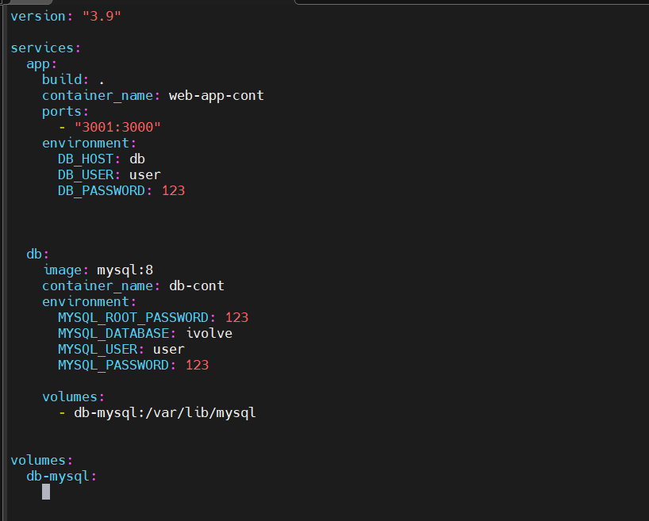
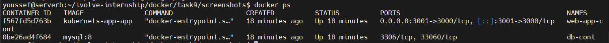
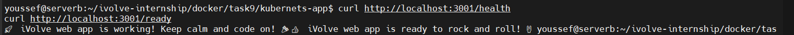
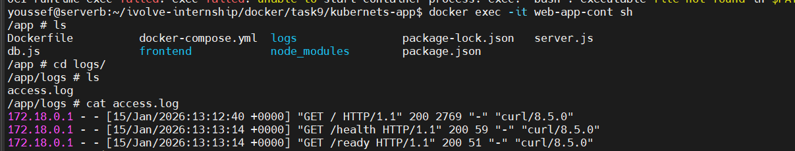

# Lab 9: Containerized Node.js and MySQL Stack Using Docker Compose

## 📌 Overview
This project demonstrates how to containerize a **Node.js application** with a **MySQL database** using **Docker Compose**.
The application depends on a MySQL database named **ivolve** to start successfully.

---

## 🛠️ Technologies Used
- Node.js
- MySQL 8.0
- Docker
- Docker Compose (v2)
- Docker Hub

---

## 📂 Project Structure
```
kubernets-app/
├── Dockerfile
├── docker-compose.yml
├── package.json
├── app/
│   └── logs/
└── README.md
```

---

## ⚙️ Prerequisites
- Docker installed
- Docker Compose v2 installed

Verify installation:
```bash
docker --version
docker compose version
```

---

## 🚀 Steps to Run the Application

### 1️⃣ Clone the Repository
```bash
git clone https://github.com/Ibrahim-Adel15/kubernets-app.git
cd kubernets-app
```

---


### 2️⃣ Build docer compose file
```bash
version: "3.9"

services:
  app:
    build: .
    container_name: web-app-cont
    ports:
      - "3001:3000"
    environment:
      DB_HOST: db
      DB_USER: user
      DB_PASSWORD: 123


  db:
    image: mysql:8
    container_name: db-cont
    environment:
      MYSQL_ROOT_PASSWORD: 123
      MYSQL_DATABASE: ivolve
      MYSQL_USER: user
      MYSQL_PASSWORD: 123

    volumes:
      - db-mysql:/var/lib/mysql


volumes:
  db-mysql:

```


### 2️⃣ Build & Run Containers


```bash
docker compose up -d --build
```

---

## ✅ Verification Steps

### 🔹 Check Running Containers
```bash
docker ps
```


### 🔹 Verify Application
```bash
curl http://localhost:3001
```

### 🔹 Health & Readiness
```bash
curl http://localhost:3001/health
curl http://localhost:3001/ready
```

---

## 🔹 Verify Logs
```bash
docker exec -it web-app-cont sh
ls /app/logs
```

---


## 🧹 Cleanup
```bash
docker compose down -v
```

---

## 👨‍💻 Author
Youssef Elmansy
