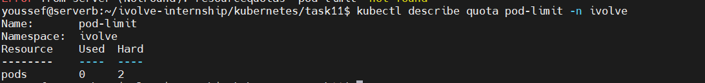

# Lab 11: Namespace Management and Resource Quota Enforcement

## 🎯 Objective
This lab demonstrates how to create a Kubernetes namespace and enforce resource limits using ResourceQuota.

---

## 🧠 Concepts Covered
- Namespaces
- ResourceQuota
- Pod limits
- Multi-tenant cluster management

---

## 🛠 Prerequisites
- Kubernetes cluster
- kubectl access

---

## 🚀 Steps

### 1️⃣ Create Namespace (Declarative)
```bash
kubectl create namespace ivolve --dry-run=client -o yaml > namespace-ivolve.yaml
kubectl apply -f namespace-ivolve.yaml
```

---

### 2️⃣ Create ResourceQuota to Limit Pods
```bash
kubectl create quota pod-limit --hard=pods=2 -n ivolve --dry-run=client -o yaml > quota.yaml
kubectl apply -f quota.yaml
```

---

### 3️⃣ Verify ResourceQuota
```bash
kubectl describe quota pod-limit -n ivolve
```

---

## ✅ Result
- The ivolve namespace allows a maximum of 2 pods.

---

## 📌 Conclusion
Namespaces combined with ResourceQuota provide effective isolation and resource governance in Kubernetes clusters.

