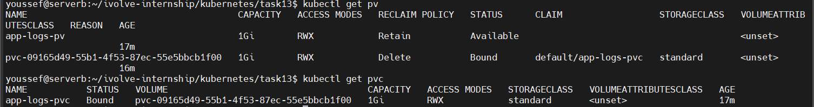

# Lab 13: Persistent Storage Setup for Application Logging

## 🎯 Objective
This lab explains how to persist application logs using Kubernetes persistent storage concepts.

## 🧠 Concepts Covered
- Persistent Volume (PV)
- Persistent Volume Claim (PVC)
- hostPath volume
- Access Modes
- Reclaim Policy

## 📌 Problem Statement
Pods in Kubernetes are ephemeral. If a pod restarts or is deleted, all data inside it is lost.
This lab ensures application logs remain persistent even if pods are recreated.

## 🛠 Prerequisites
- Running Kubernetes cluster (Minikube recommended)
- kubectl configured

## 🗂 Storage Architecture
Node Directory → PersistentVolume → PersistentVolumeClaim → Pod

## 🚀 Steps

### 1️⃣ Prepare Node Storage Path
```bash
minikube ssh
sudo mkdir -p /mnt/app-logs
sudo chmod 777 /mnt/app-logs
exit
```

### 2️⃣ Create Persistent Volume (PV)
```yaml
apiVersion: v1
kind: PersistentVolume
metadata:
  name: app-logs-pv
spec:
  capacity:
    storage: 1Gi
  accessModes:
    - ReadWriteMany
  persistentVolumeReclaimPolicy: Retain
  hostPath:
    path: /mnt/app-logs
```

### 3️⃣ Create Persistent Volume Claim (PVC)
```yaml
apiVersion: v1
kind: PersistentVolumeClaim
metadata:
  name: app-logs-pvc
spec:
  accessModes:
    - ReadWriteMany
  resources:
    requests:
      storage: 1Gi
```

## ✅ Verification
```bash
kubectl get pv
kubectl get pvc
```

Both should be in `Bound` state.




## 📌 Conclusion
Persistent Volumes allow Kubernetes workloads to store data safely outside pod lifecycle.

