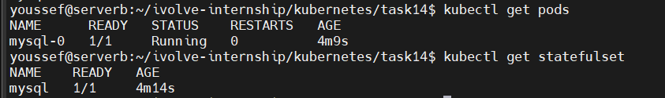
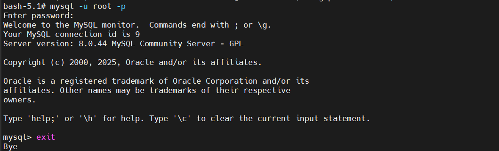
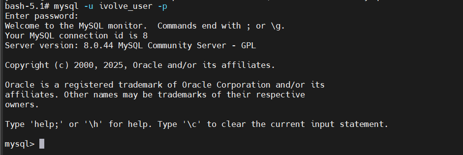

# Lab 14: StatefulSet with Headless Service (MySQL)

## 🎯 Objective
This lab demonstrates how to deploy a stateful application (MySQL) using StatefulSet with persistent storage and secure credentials.

---

## 🤠 Concepts Covered
- StatefulSet
- Headless Service
- Secrets (with MYSQL_USER, MYSQL_PASSWORD, MYSQL_DATABASE)
- Taints and Tolerations
- Persistent Volume Claims

---

## 📌 Why StatefulSet?
Databases require:
- Stable network identity
- Persistent storage
- Ordered startup

StatefulSet provides all of the above.

---

## 🛠️ Prerequisites
- Kubernetes cluster
- Tainted node with key: node=worker:NoSchedule

---

## 🚀 Steps

### 1️⃣ Create Secret for MySQL Credentials
```bash
kubectl create secret generic mysql-secret \
  --from-literal=MYSQL_ROOT_PASSWORD=root123 \
  --from-literal=MYSQL_USER=ivolve_user \
  --from-literal=MYSQL_PASSWORD=ivolve123 \
  --from-literal=MYSQL_DATABASE=ivolve \
  -n ivolve \
  --dry-run=client -o yaml > mysql-secret.yaml

kubectl apply -f mysql-secret.yaml
```

### 2️⃣ Create Headless Service
```yaml
apiVersion: v1
kind: Service
metadata:
  name: mysql
spec:
  clusterIP: None
  selector:
    app: mysql
  ports:
    - port: 3306
```

### 3️⃣ Create MySQL StatefulSet
```yaml
apiVersion: apps/v1
kind: StatefulSet
metadata:
  name: mysql
spec:
  serviceName: mysql
  replicas: 1
  selector:
    matchLabels:
      app: mysql
  template:
    metadata:
      labels:
        app: mysql
    spec:
      tolerations:
      - key: "node"
        operator: "Equal"
        value: "worker"
        effect: "NoSchedule"
      containers:
      - name: mysql
        image: mysql:8.0
        ports:
        - containerPort: 3306
        env:
        - name: MYSQL_ROOT_PASSWORD
          valueFrom:
            secretKeyRef:
              name: mysql-secret
              key: MYSQL_ROOT_PASSWORD
        - name: MYSQL_USER
          valueFrom:
            secretKeyRef:
              name: mysql-secret
              key: MYSQL_USER
        - name: MYSQL_PASSWORD
          valueFrom:
            secretKeyRef:
              name: mysql-secret
              key: MYSQL_PASSWORD
        - name: MYSQL_DATABASE
          valueFrom:
            secretKeyRef:
              name: mysql-secret
              key: MYSQL_DATABASE
        volumeMounts:
        - name: mysql-storage
          mountPath: /var/mysql
  volumeClaimTemplates:
  - metadata:
      name: mysql-storage
    spec:
      accessModes:
        - ReadWriteOnce
      resources:
        requests:
          storage: 1Gi
```

### 4️⃣ Verification
```bash
kubectl get statefulset
kubectl get pods
kubectl get pvc
```



### 5️⃣ Test Database Connection
```bash
kubectl exec -it mysql-0 -- mysql -u root -p ivolve


kubectl exec -it mysql-0 -- mysql -u ivolve_user -p ivolve
```






## 📌 Conclusion

Secrets must include all keys MySQL requires: MYSQL_ROOT_PASSWORD, MYSQL_USER, MYSQL_PASSWORD, MYSQL_DATABASE.

ConfigMap stores non-sensitive connection parameters only (host, app user if needed).

StatefulSet + headless service + persistent storage is the recommended way to deploy databases in Kubernetes.

