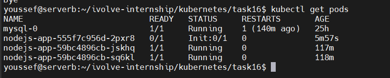
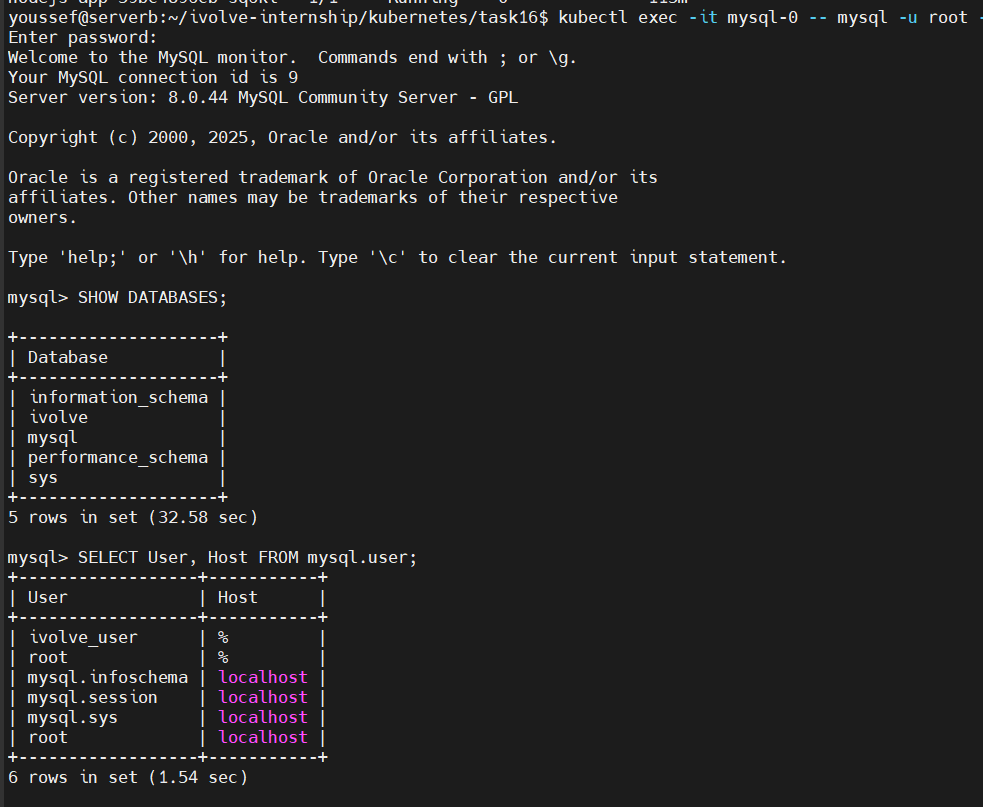

# Lab16-README.md - Kubernetes Init Container for Pre Deployment Database Setup

## 🎯 Objective

In this lab, we will learn how to add an **Init Container** to a Node.js application on Kubernetes to perform a **Database setup** before the application runs:

* Create the `ivolve` database
* Create the user `ivolve_user` and grant all privileges on the database
* Use ConfigMap and Secret for DB connection

## 🤠 Concepts Covered

* Init Container
* ConfigMap / Secret
* Persistent Volume Claim
* Deployment update
* MySQL client container

---

## 🧠 Lab Overview

The goal here:

1. Run an existing Node.js Deployment
2. Before the Pod starts:
   * The Init Container will connect to MySQL
   * It will create the database and user
3. The main Pod will start only after the Init Container finishes successfully

---

## 📦 Components

### 1️⃣ Init Container

* Image: `mysql:5.7`
* Responsible for setting up the DB before the application starts
* Uses environment variables from Secret and ConfigMap
* Example command:

```sh
mysql -h $DB_HOST -u $MYSQL_ROOT_USER -p$MYSQL_ROOT_PASSWORD -e "
CREATE DATABASE IF NOT EXISTS $MYSQL_DATABASE;
CREATE USER IF NOT EXISTS '$MYSQL_USER'@'%' IDENTIFIED BY '$MYSQL_PASSWORD';
GRANT ALL PRIVILEGES ON $MYSQL_DATABASE.* TO '$MYSQL_USER'@'%';
FLUSH PRIVILEGES;"
```

### 2️⃣ Node.js Application Pod

* Starts after the Init Container succeeds
* Uses the same PVC and ConfigMap from Lab 15
* Can use a private image if needed

### 3️⃣ Persistent Volume Claim

* Already created in Lab 15
* Mounted to `/usr/src/app/data` in the Pod

---

## 🛠️ Steps

### 1️⃣ Update Deployment to Add Init Container

`nodejs-init-deployment.yaml`

```yaml
apiVersion: apps/v1
kind: Deployment
metadata:
  name: nodejs-app
spec:
  replicas: 2
  selector:
    matchLabels:
      app: nodejs
  template:
    metadata:
      labels:
        app: nodejs
    spec:
      imagePullSecrets:
      - name: dockerhub-secret
      tolerations:
      - key: "node"
        operator: "Equal"
        value: "worker"
        effect: "NoSchedule"
      initContainers:
      - name: init-mysql
        image: mysql:5.7
        env:
        - name: DB_HOST
          value: mysql.ivolve.svc.cluster.local
        - name: MYSQL_ROOT_USER
          value: root
        - name: MYSQL_ROOT_PASSWORD
          valueFrom:
            secretKeyRef:
              name: mysql-secret
              key: MYSQL_ROOT_PASSWORD
        - name: MYSQL_DATABASE
          valueFrom:
            secretKeyRef:
              name: mysql-secret
              key: MYSQL_DATABASE
        - name: MYSQL_USER
          valueFrom:
            secretKeyRef:
              name: mysql-secret
              key: MYSQL_USER
        - name: MYSQL_PASSWORD
          valueFrom:
            secretKeyRef:
              name: mysql-secret
              key: MYSQL_PASSWORD
        command:
        - sh
        - -c
        - |
          mysql -h $DB_HOST -u $MYSQL_ROOT_USER -p$MYSQL_ROOT_PASSWORD -e "
          CREATE DATABASE IF NOT EXISTS $MYSQL_DATABASE;
          CREATE USER IF NOT EXISTS '$MYSQL_USER'@'%' IDENTIFIED BY '$MYSQL_PASSWORD';
          GRANT ALL PRIVILEGES ON $MYSQL_DATABASE.* TO '$MYSQL_USER'@'%';
          FLUSH PRIVILEGES;"
      containers:
      - name: nodejs
        image: youssefaelmansy/nodejs-iamge:1.0
        ports:
        - containerPort: 3000
        envFrom:
        - configMapRef:
            name: nodejs-config
        volumeMounts:
        - name: app-storage
          mountPath: /usr/src/app/data
      volumes:
      - name: app-storage
        persistentVolumeClaim:
          claimName: app-pvc
```

### 2️⃣ Apply the Deployment

```bash
kubectl apply -f nodejs-init-deployment.yaml
```

### 3️⃣ Check Pod Status

```bash
kubectl get pods
```




* The Init Container will appear under the Init column
* After it succeeds, the main Pod will start running

### 4️⃣ Inspect Init Container Logs

```bash
kubectl logs <pod-name> -c init-mysql
```

Check the logs to ensure the DB and user were created

### 5️⃣ Verify Database Manually

```bash
kubectl exec -it mysql-0 -- mysql -u root -p
```

```sql
SHOW DATABASES;
SELECT User, Host FROM mysql.user;
```

* Make sure the `ivolve` database exists
* Ensure the `ivolve_user` exists and has full privileges on the database



### 6️⃣ Verify Node.js Application

```bash
kubectl get pods
kubectl get deployment
kubectl get pvc
kubectl get svc
```

* Main Pod Running
* PVC Bound
* Service exists (ClusterIP)

